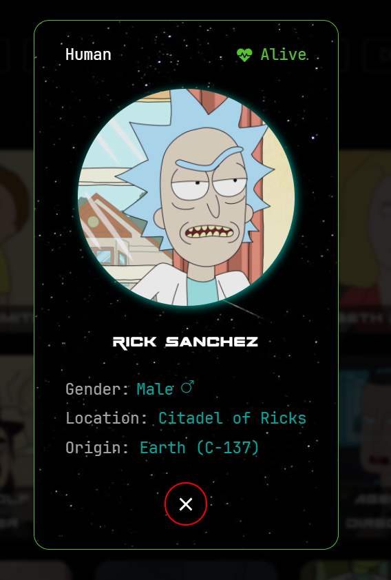
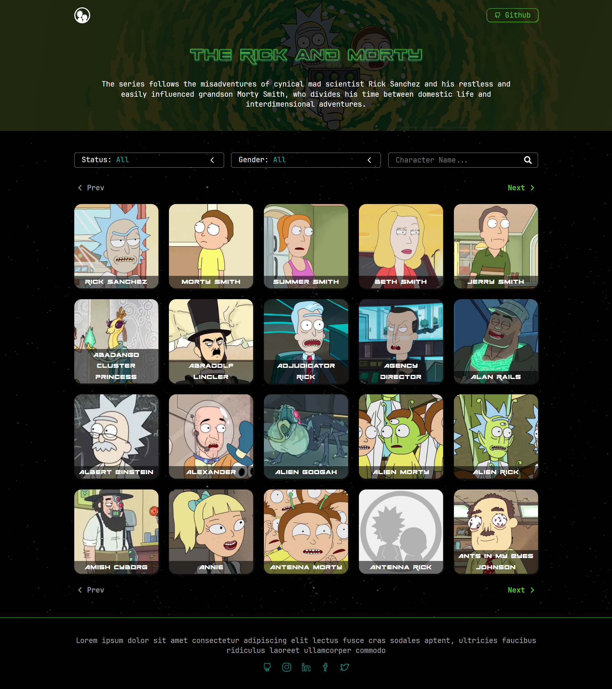

# Rick and Morty

This website will show all the characters from the Rick and Morty series showing detailed information and more.

## ⚙️ Function of the website

- You can filter rick and morty characters using some of the following ways.
  1. status: Indicates whether alive, dead or unknown.
  2. Gender: Indicates if male, female, genderless or unknown.
  3. Search name: Adding a name will search for all characters in the series that contain that name.
- The character card allows you to view certain information about the character.

  

  When you click on the character's card, a modal will appear where you can see more information about the character.

   

## 🚀 Technologies and tools used

- [ReactJS](https://es.react.dev/)
- [TypeScript](https://www.typescriptlang.org/)
- [Vite](https://vitejs.dev/)
- [The Rick and Morty API](https://rickandmortyapi.com/)

### Dependencies

- [sass](https://sass-lang.com/)
- [React-icons](https://www.npmjs.com/package/react-icons)

## 📊 Project status

| Status      | Start date | End date   |
| ----------- | ---------- | ---------- |
| ✅ Complete | 2024-10-15 | 2024-10-22 |

## 🌐 [Website](https://bryangrandon.github.io/Rick-and-Morty/)

